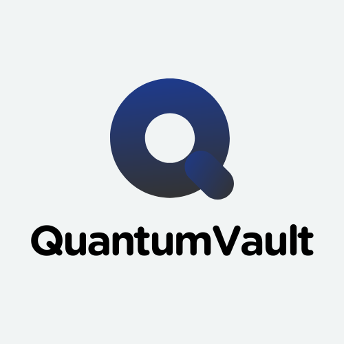

<p align="center">
  
</p>

<h1 align="center">QuantumVault 🔐</h1>

<p align="center">
  A post-quantum cryptography (PQC) tool for secure file encryption and decryption.<br>
  Built with <a href="https://www.python.org/">Python 3</a> using quantum-resistant algorithms and AES.<br>
  Created for the CS50P final project, by João Pedro da Silva Ramalho but intended for wider use.
</p>

<p align="center">
  <a href="https://raw.githubusercontent.com/joaopramalho/QuantumVault/master/LICENSE">
    
  </a>
</p>

---

## ✨ Features

- ✅ **Kyber + AES Encryption (click here to know how it works)**  
- ⚙️ **Cross-Platform**  
- 💻 **Command-Line Interface**  
- 🖼️ **Graphical User Interface**  

---

## 📸 Screenshots

<p align="center">
  
</p>

---

## 🆘 How to Use

1. **Clone this repository**  
   ```bash
   git clone https://github.com/joaopramalho/QuantumVault.git
   ```
2. **Navigate to the project folder**  
   ```bash
   cd QuantumVault
   ```
3. **Install the required packages**  
   ```bash
   pip install -r requirements.txt
   ```
4. **Run the application**  
   - To start the GUI:  
     ```bash
     python main.py
     ```
   - To use the CLI and see help:  
     ```bash
     python main.py -h
     ```

**Logs** are saved in the `logs` folder inside the project directory.
---

## 🛠️ Roadmap

- [ ] Generate Windows executable  

---


## ⚠️ Warning!

Artificial Inteligence was used for the creation of the GUI, a bit of the cryptography, test_qvault.py, repetitive tasks (such as logging) and a bit of the qvaults.py. The most of the project was made by me.

---